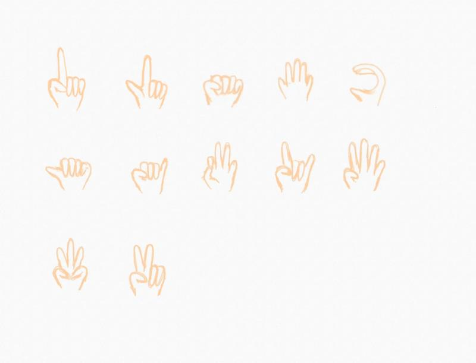

# Handy-the-Mystic-Hand

## Team Member

- Yo-Hsuan Chen
- Haike Yu
- Suqing Liu

## Group Name

Handy, the Mystic Hand

[Link to GitHub Repository](https://github.com/Handy-the-Mystic-Hand/Handy-the-Mystic-Hand)

## Final Product & Summary

What we have now: 

12 hand signs for the user to choose from, the first 9 are default sign and functions pair while the last 3 are customizable hand signs.

The Included hand signs are:

The prompt to ask user for customizable new functions:

The Accuracy of our model is: 90%

## Distribution of Responsibilities in the Group

- Yo-Hsuan Chen:
	- Model Training and Training Algorithm Selection

- Haike Yu:
	- Data Gathering and Filtering, Data Model Training

- Suqing Liu:
	- Connection of Operation System. Building Software Development Kit

## Machine-vision Problem

Hand Posture Control

- Tracking hand movement and posture to send requests to the Operating System.
- Keyboard-Free working environment

## Example Use Cases

- Control the mouse and click
- Keyless Keyboard
- Custom Designs:
  - Instrumentness Music Instruments, Controlness Controller
  - Shut down the screen, Volume control, Swipe left and swipe right of the screen, Zoom in and zoom out
  - And more

## Name of Dataset and Location

- [Leap Gesture Recognition Dataset](https://www.kaggle.com/datasets/gti-upm/leapgestrecog)
- [ASL Dataset](https://www.kaggle.com/datasets/ayuraj/asl-dataset)
- [Hand Sign Images Dataset](https://www.kaggle.com/datasets/ash2703/handsignimages)
- [Hand Gesture Recognition Database](https://www.kaggle.com/datasets/gti-upm/leapgestrecog)

## Paper References

N/A

## Reasons for Choosing this Specific Problem and Dataset

We found it to be a revolutionary change if we could control our systems with no other devices than our hands. As Computer Science students ourselves we sit in a fixed position in front of our laptops/pc for the majority of the time of the day, which is detrimental for us. We would like to create this new way of interacting with the screen such that we have the freedom to move around more while doing our work. We also hope users can customize our application to fit their needs. The databases we have selected are incredibly rich, with many hand poses already labeled, and there is a vast amount of images serving as data. This allows us to make our design and data processing more convenient. We will be using both OpenCV, Jupyter Notebook, and PyAutoGUI as our main tools for development. We will use Github to do our works separately and merge them at the end. We will communicate through our Discord Server.

## Dataset Access

- Haiki Yu

## Source Code Repository Set Up

- Yo-Hsuan Chen

## Resources

### YouTube Videos

- [Learn Computer Vision with CVZone in 2 Hours](https://www.youtube.com/watch?v=ieXQTtQgyo0&t=15s)
- [Coffee Machine Virtual Interface using Computer Vision](https://www.youtube.com/watch?v=trIwJ17YmsI)
- [Multiple Hand Gesture Control with OpenCV Python | CVZone](https://www.youtube.com/watch?v=3xfOa4yeOb0)
- [Virtual Drag and Drop using OpenCV Python | CVZone](https://www.youtube.com/watch?v=6DxN8G9vB50)

### Kaggle Datasets

- [Leap Gesture Recognition Dataset](https://www.kaggle.com/datasets/gti-upm/leapgestrecog)
- [ASL Dataset](https://www.kaggle.com/datasets/ayuraj/asl-dataset)
- [Hand Sign Images Dataset](https://www.kaggle.com/datasets/ash2703/handsignimages)

### Tools

- [PyAutoGUI](https://pyautogui.readthedocs.io/en/latest/)
- [OpenCV](https://opencv.org/)
